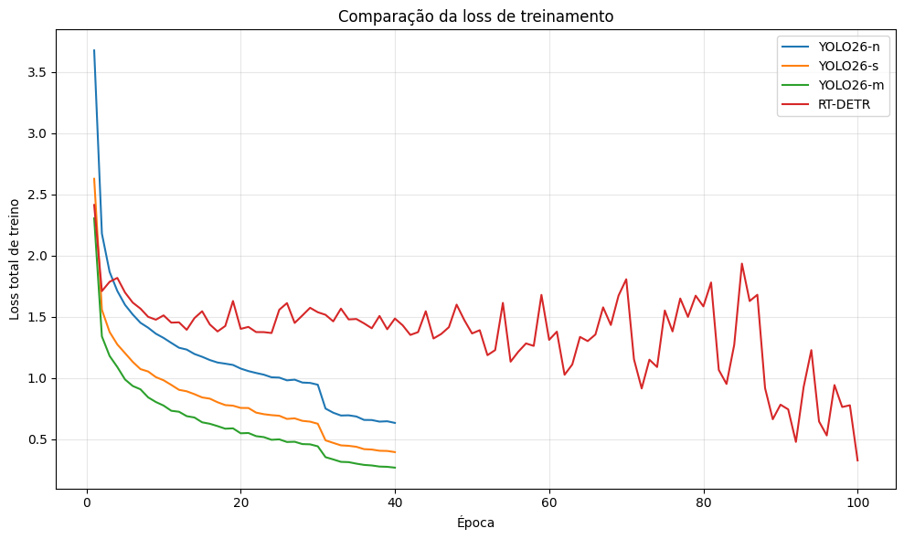
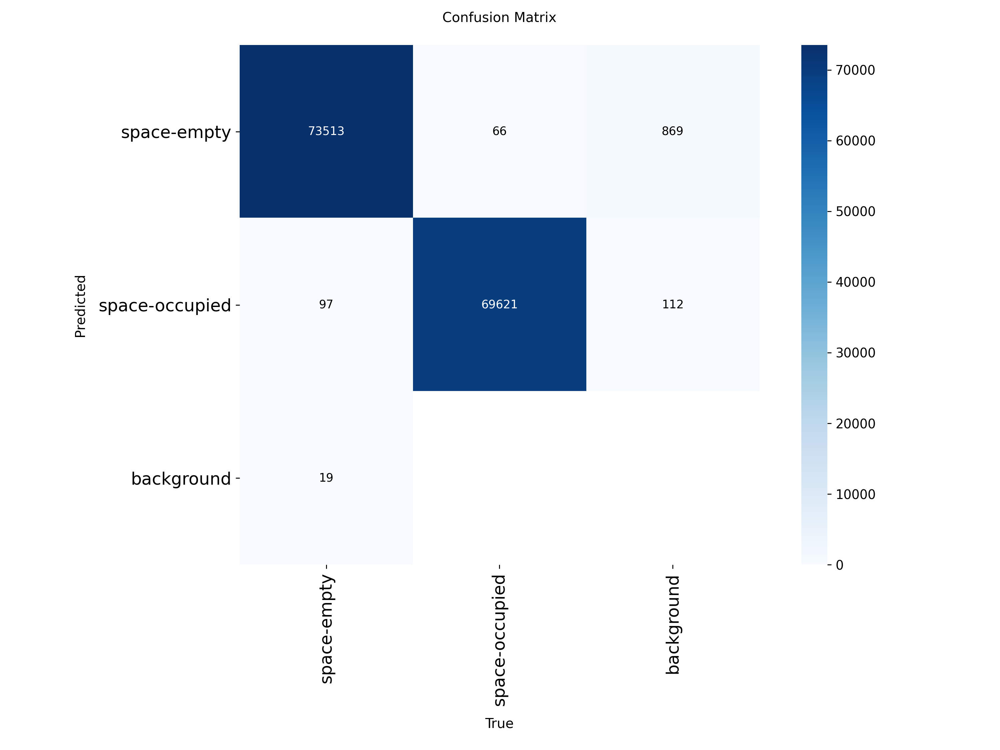
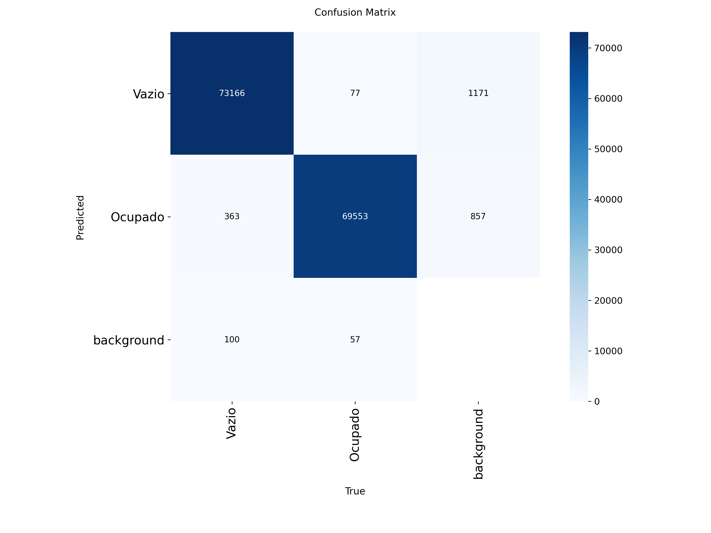
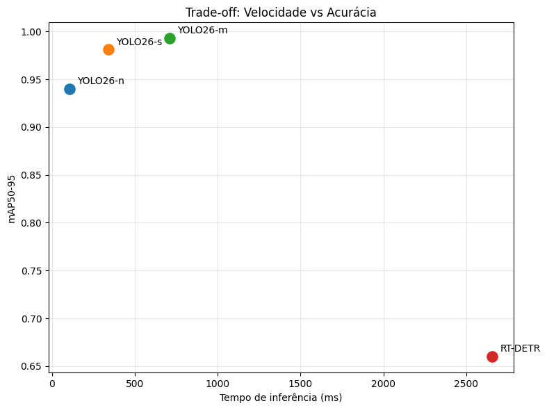

# Detecção de Vagas de Estacionamento com RT-DETR e YOLO no Dataset PKLot 🚗🅿️

Este repositório contém a implementação, treinamento e avaliação comparativa de modelos de Deep Learning voltados para a detecção de objetos aplicada ao monitoramento de estacionamentos inteligentes. O foco principal deste projeto foi avaliar o desempenho do modelo **RT-DETR-L** (Real-Time Detection Transformer) frente às variantes **YOLOv8 (Nano, Small e Medium)** utilizando o dataset público **PKLot**.

---
Como Reproduzir este Projeto:

1. git clone [https://github.com/seu-usuario/seu-repositorio.git](https://github.com/seu-usuario/seu-repositorio.git)
cd seu-repositorio

2. Crie uma conta no Kaggle, gere um Token de API (kaggle.json) e insira suas credenciais no campo indicado dentro do Notebook desejado para realizar o download automático dos dados.

3. Execute as células do ambiente. Caso utilize um cluster com SLURM, o comando de envio será executado nativamente pelo próprio notebook:
   sbatch rodar_cluster.sh
## 📌 Visão Geral do Projeto

Este projeto propõe uma abordagem de detecção de objetos de ponta a ponta para classificar se espaços demarcados estão **Vazio (0)** ou **Ocupado (1)**.

### Modelos Avaliados:
* **RT-DETR-L**: Um modelo baseado em Transformers voltado para tempo real.
* **YOLOv8n (Nano)**: Modelo extremamente leve, focado em dispositivos embarcados e baixa latência.
* **YOLOv8s (Small)**: Um meio-termo ideal entre velocidade e precisão.
* **YOLOv8m (Medium)**: Modelo mais robusto com maior capacidade de extração de características.

---

## 📊 O Dataset (PKLot)

O **PKLot** dataset consiste em imagens capturadas de diferentes estacionamentos sob diversas condições climáticas (dias ensolarados, nublados e chuvosos). 

* **Total de Imagens:** 12.416 imagens obtidas via extração e conversão de formato.
* **Divisão dos Dados:**
  * **Treino:** 8.691 imagens (com arquivos de cache para acesso rápido)
  * **Validação:** 2.483 imagens
  * **Teste:** 1.242 imagens
* **Classes:** * `0`: Vazio (Space-empty)
  * `1`: Ocupado (Space-occupied)

O pipeline de dados deste repositório inclui um script automático para converter as anotações originais de formato **COCO (JSON)** para o formato adequado **YOLO (TXT)**.

---

## ⚙️ Infraestrutura e Pipeline de Treinamento

O treinamento do modelo RT-DETR-L foi realizado utilizando um ambiente de supercomputação em cluster acadêmico com gerenciamento de filas **SLURM**, fazendo uso de aceleração por GPU **NVIDIA Tesla A100 (16GB)**.

O pipeline estruturado no Jupyter Notebook executa os seguintes passos:
1. Instalação de dependências (`ultralytics`, `pycocotools`, `kaggle`).
2. Autenticação automatizada e download dos dados através da API do Kaggle.
3. Conversão de caixas delimitadoras de COCO para YOLO.
4. Geração dinâmica do arquivo de configuração `parking.yaml`.
5. Orquestração e submissão do Job via Bash script (`sbatch rodar_cluster.sh`) escalando o treinamento de forma assíncrona por **100 épocas**.

---

## 📈 Resultados e Comparações

### Curva de Aprendizado (Loss)
Abaixo está o gráfico comparativo da perda total de treinamento acumulada entre o RT-DETR e os modelos YOLO:

  

### Matriz de Confusão e Métricas Finais
Para validar a precisão de cada modelo no conjunto de testes do PKLot, avaliou-se o comportamento das curvas de precisão, revocação e mAP (Mean Average Precision).

Matriz de Confusão RT-DETR

  
  

  Matriz de Confusão Yolo26n
  

  
  

  Matriz de Confusão Yolo26s
  

  
  

  Matriz de Confusão Yolo26m
  

  
  

  

### Tabela Resumo de Desempenho

| Modelo | Parâmetros | GFLOPs | mAP50 (Val) | mAP50-95 (Val) |
| :--- | :---: | :---: | :---: | :---: |
| **YOLOv26n** | ~3.2M | ~8.7 | 0.994 | 0.940 |
| **YOLOv26s** | ~11.2M | ~28.6 | 0.995 | 0.980 |
| **YOLOv26m** | ~25.9M | ~78.9 | 0.995 | 0.993 |
| **RT-DETR-L** | **32.8M** | **108.0** | 0.993 | 0.660 |

*(Nota: Complete os dados da tabela acima com os valores finais obtidos nas últimas linhas do arquivo `results.csv` de cada respectivo modelo).*

### Análise Visual das Detecções

  

<em>Exemplo de inferência lado a lado comparando as predições de caixas delimitadoras nos espaços do estacionamento.</em>

---
